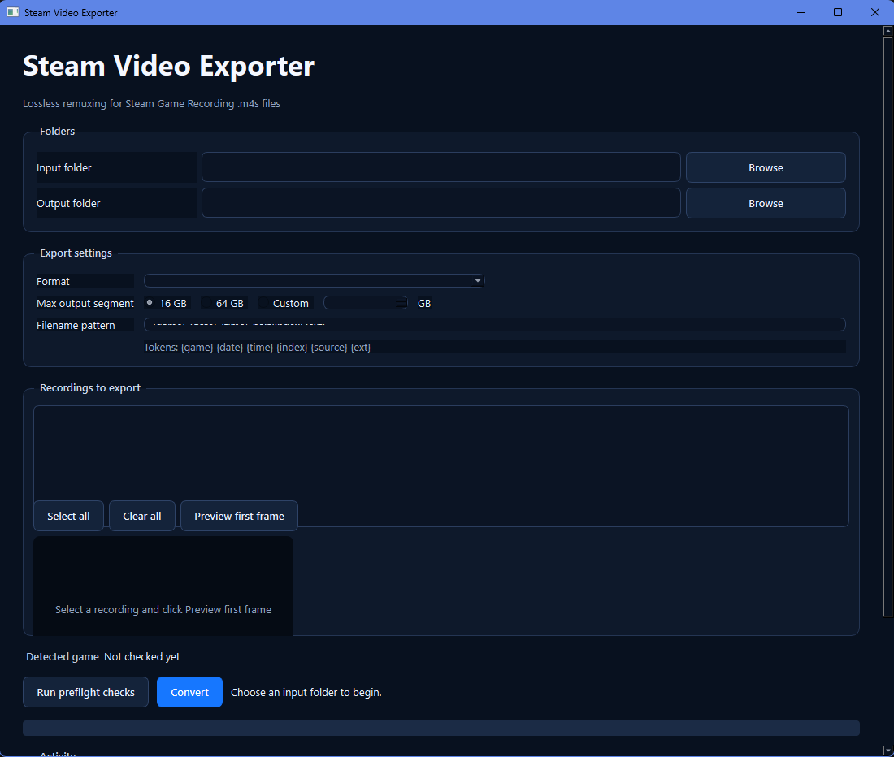

# Steam Video Exporter

<p align="center">
  
</p>

Standalone Windows GUI for losslessly remuxing Steam Game Recording footage into MP4, MOV, or FLV. It accepts a single recording directory or a Steam library root such as `D:\Videos\Steam`; library roots are grouped by each `bg_<appid>_<timestamp>` directory, so unrelated sessions are never concatenated.

The exporter reads Steam's `session.mpd` manifest when present. This preserves the original DASH video and audio streams with FFmpeg stream copy—no video or audio is re-rendered.

## What it does

- Resolves the Steam game name from local Steam metadata or Steam's app details service, instead of using the recording folder name.
- Shows each recording in a checkable batch list, with Select all and Clear all actions.
- Generates a first-frame preview for the selected recording.
- Supports MP4, MOV, and FLV output, with 16 GB, 64 GB, or custom maximum segment sizes.
- Supports custom output folders and filename tokens.
- Runs preflight checks for source discovery, FFmpeg, output writability, and available disk space.

## Run from source

1. Install Python 3.10+ and [uv](https://docs.astral.sh/uv/) on Windows.
2. Put `ffmpeg.exe` (and preferably `ffprobe.exe`) beside `steam_video_exporter.py`, or add FFmpeg to `PATH`.
3. Run with uv (the project environment is created automatically):

```powershell
uv run python .\steam_video_exporter.py
```

## TDD pre-commit hook

The repository uses the version-controlled `.githooks/pre-commit` hook to run the unit-test suite before each commit. Enable it once per clone:

```powershell
git config core.hooksPath .githooks
```

The hook also enforces an 80% minimum coverage threshold for the testable conversion core (`steam_exporter.media` and `steam_exporter.models`). The Qt UI and thread wiring are covered separately through integration checks.

## Package as a standalone EXE

The included build script uses the uv-managed environment and does not call `pip`:

```powershell
.\build.ps1
```

The build script resolves FFmpeg and FFprobe from the project folder or `PATH`, then copies both next to the EXE in `dist`. Keep all three files together when moving the standalone app.

## Exporting a whole Steam library and deleting source fragments

For a large library with insufficient free space to duplicate everything at once, use the sequential migration script. It exports one recording at a time to `D:\Videos\Steam\exports`, verifies the resulting MP4 segments with FFprobe, then deletes only that recording's original `bg_*` source folder before starting the next one.

> Warning: this permanently deletes the original Steam recording fragments after verification. Confirm that `D:\Videos\Steam\exports` is the intended destination before running it.

```powershell
uv run python -m scripts.export_library_and_prune --delete-sources
```

The script intentionally stops on any failed preflight, remux, or duration verification; it keeps the current source recording intact when that happens. Progress is written to `D:\Videos\Steam\exports\export-and-prune.log`.

## Filename tokens

The default pattern is `{game}_{date}_{time}_part{index}.{ext}`.

Available tokens are `{game}`, `{source}`, `{date}` (`YYYY-MM-DD`), `{time}` (`HH-MM-SS`), `{index}` (`001`, `002`, ...), and `{ext}`.

## Notes

- Preflight checks the input folder, recording grouping, `.m4s` discovery, FFmpeg availability, output-folder writability, and free disk space.
- After preflight, each recording folder appears as a checked item; clear individual items or use Select all/Clear all to choose a partial batch.
- Select a recording and use Preview first frame to generate a temporary thumbnail through FFmpeg.
- Conversion uses FFmpeg stream copy (`-c copy`) and never re-renders the video or audio. If the source codecs are not accepted by the requested container, the app reports the failure instead of silently re-encoding.
- Conversion stages output files in a temporary subfolder and only moves completed segments into the selected output folder.
- Segment size is treated as GiB-style GB (`1 GB = 1024^3 bytes`) and is checked after encoding. The app automatically retries with shorter segment durations when a segment is too large.
