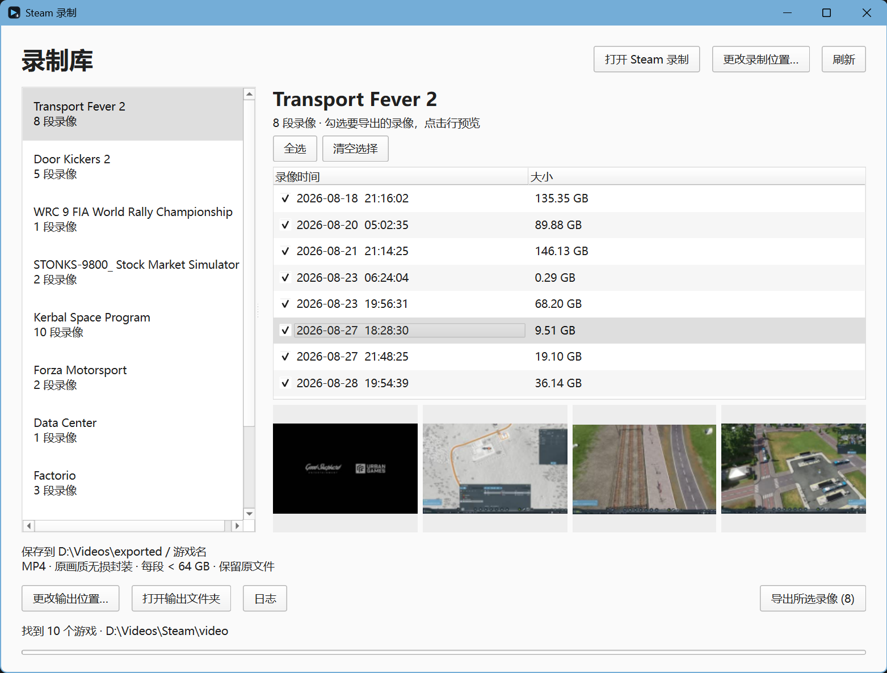

# Steam Quick Export

<p align="center">
  
</p>

Losslessly remux Steam Game Recording footage into MP4 — no re-encoding, so
quality and sync are identical to the original capture.

Steam Quick Export ("Steam 录制") is the Windows app. It automatically finds
your Steam library and recordings; no folder or AppID entry is needed.

> Looking for architecture, internals, or contributor notes instead? See
> [CLAUDE.md](CLAUDE.md).

## Downloads

Grab the latest build from [Releases](../../releases). Each version ships as
two zips:

- **`...-win-x64-ffmpeg.zip`** — includes FFmpeg/ffprobe, works out of the box.
- **`...-win-x64.zip`** — smaller, for when you already have FFmpeg on `PATH`
  or want to supply your own.

## Run from source

1. Install Python 3.10+ and [uv](https://docs.astral.sh/uv/) on Windows.
2. Put `ffmpeg.exe` (and preferably `ffprobe.exe`) beside the app, or add
   FFmpeg to `PATH`.
3. Run with uv (the project environment is created automatically):

```powershell
uv run python .\steam_quick_export.py
```

## Steam Quick Export ("Steam 录制")

Run `uv run python steam_quick_export.py`, or launch the packaged
`SteamQuickExport.exe`. Click a game, check the recordings you want, click one
for a four-frame preview, hit export. **Source recordings are never deleted
by this app.** Output defaults to your Windows Videos folder under
`exported/<game>/`.

- Scans your whole library automatically and caches the result, so reopening
  the app is fast; hold Shift while clicking Refresh to force a full rescan.
- **中文 / English**: click the language button in the top right to switch the
  whole UI (including export logs) instantly; the choice is remembered.
- Your recordings folder, output folder, and window layout are remembered
  between runs.
- **Open Steam Recordings** opens Steam's own screenshot/recording manager so
  you can delete captures through Steam; click Refresh afterward.
- Exporting runs in the background, so the library stays browsable and you
  can cancel an export at any time without closing the app.
- **Export queue**: while one game exports, click "Queue export" on another
  game to line it up; tasks run one by one automatically. Queued recordings
  are locked against double-triggering, and you can right-click a queued game
  to remove it from the queue.
- Output is MP4 via stream copy, capped at 64 GB per file (larger recordings
  are split automatically), and each export writes a `verification.json`
  confirming durations and codecs matched the source.

### Package as a standalone EXE

```powershell
.\scripts\get-ffmpeg.ps1   # fetches the pinned, hash-verified FFmpeg into dist\
.\build-quick.ps1 -BundleFFmpeg
```

Keep the entire `dist-simple\SteamQuickExport\` folder together — it bundles
Python, Qt, FFmpeg, and ffprobe. A plain `.\build-quick.ps1` (without the
flag) produces a much smaller build that finds FFmpeg on `PATH` (or via
`FFMPEG_PATH`) at runtime instead.

## Exporting a whole library and deleting source fragments

For a large library with insufficient free space to duplicate everything at
once, use the sequential migration script. It exports one recording at a time
with the same verified pipeline as the app, then deletes only that recording's
original source folder before starting the next one.

By default it reads `%USERPROFILE%\Videos\Steam\video` and writes to
`%USERPROFILE%\Videos\Steam\exports`; pass `--source` / `--output` to override.

> Warning: this permanently deletes the original Steam recording fragments
> after verification. Confirm the destination folder before running it.

```powershell
uv run python -m scripts.export_library_and_prune --delete-sources
# Custom locations:
uv run python -m scripts.export_library_and_prune --delete-sources --source "D:\Videos\Steam" --output "E:\Exports"
```

Each exported recording gets a `verification-<recording>.json` report. It
stops on any failed remux or verification, leaving the current source
recording intact.

## License

[MIT](LICENSE)
